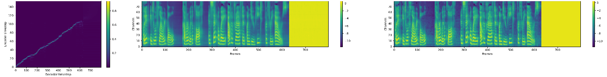

# Tacotron 2 (without wavenet)

PyTorch implementation of [Natural TTS Synthesis By Conditioning
Wavenet On Mel Spectrogram Predictions](https://arxiv.org/pdf/1712.05884.pdf). 

This implementation includes **distributed** and **automatic mixed precision** support
and uses the [LJSpeech dataset](https://keithito.com/LJ-Speech-Dataset/).

Distributed and Automatic Mixed Precision support relies on NVIDIA's [Apex] and [AMP].

Visit our [website] for audio samples using our published [Tacotron 2] and
[WaveGlow] models.

## Acknowledgements
This implementation uses code from the following repos: [Keith
Ito](https://github.com/keithito/tacotron/), [Prem
Seetharaman](https://github.com/pseeth/pytorch-stft) as described in our code.

We are inspired by [Ryuchi Yamamoto's](https://github.com/r9y9/tacotron_pytorch)
Tacotron PyTorch implementation.

We are thankful to the Tacotron 2 paper authors, specially Jonathan Shen, Yuxuan
Wang and Zongheng Yang.

[WaveGlow]: https://drive.google.com/open?id=1rpK8CzAAirq9sWZhe9nlfvxMF1dRgFbF
[Tacotron 2]: https://drive.google.com/file/d/1c5ZTuT7J08wLUoVZ2KkUs_VdZuJ86ZqA/view?usp=sharing
[pytorch 1.0]: https://github.com/pytorch/pytorch#installation
[website]: https://nv-adlr.github.io/WaveGlow
[ignored]: https://github.com/NVIDIA/tacotron2/blob/master/hparams.py#L22
[Apex]: https://github.com/nvidia/apex
[AMP]: https://github.com/NVIDIA/apex/tree/master/apex/amp